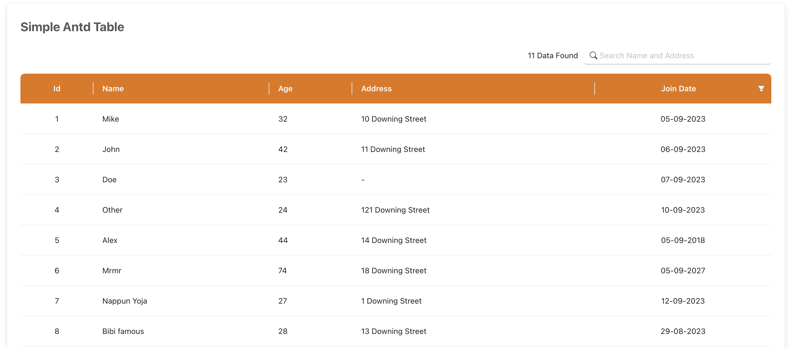

# Compilation of Simple Table

This project was using React18, TypeScript, React-Dom and antd for the Table 

## Available Scripts

In the project directory, you can run:

### `npm start`

## Path
navigate to `/table-antd` to redirect to simple antd Table 

This table only use static data from constant.js and it has other functionality such as search by name and address and filter by join date year, 
data found indicated amount of data shown in the table

this is filtered data example

navigate to `/table-mui` to redirect to simple Mui Table

This table only use static data from constant.js data found indicated amount of data shown in the table

